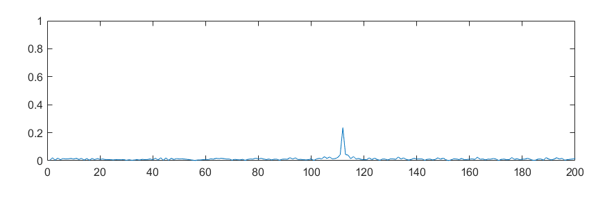

# Radar Target Generation and Detection #
Project from the Sensor Fusion Nanodegree of Udacity

## Project Overview

The processing flow in the Matlab project consists of the following steps:
- Moving Target Generation
- FMCW configuration: here the parameters for slope and alike are calculated from the requirements
- FMCW Waveform Generation
- Range Measurement
- Range Doppler Response
- CFAR Detection

## System Requirements

## Target Generation

For the target I decided to pick the following values.

## FMCW Configuration

Out of the system requirements parameters like bandwidth, chirp time and slope are generated
using the formulars introduced in the course.

The calculated slope is 2.0455e+13 which matches the value giving in the rubic.

## Waveform Generation

The waveforms of the transmitted signal Tx, the received signal Rx and the mixer signal Mix are calculated
using the formulas introduced in the course.

## Range FFT

To perform the range FFT the following steps are performed: 
- matrix gets transposed 
- fft function is called
- output is normalized
- absolute value is taken
- second half of the spectrum is removed

The generated output clearly shows our target.

## Doppler FFT

The code provided with the template generated the output below which again shows our target.

## 2D CFAR

